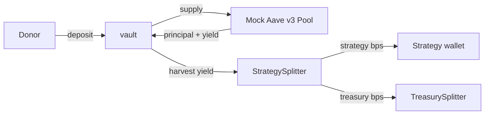
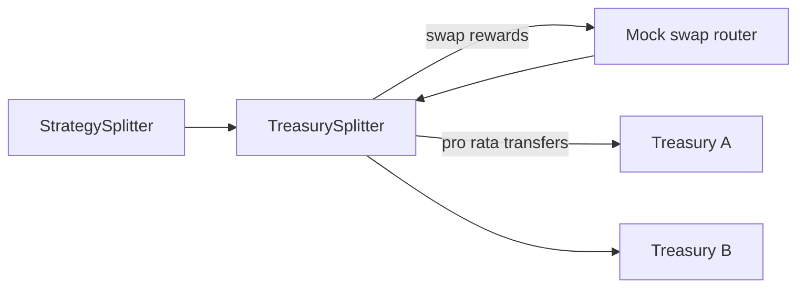

# 🏗 Scaffold-ETH 2

<h4 align="center">
  <a href="https://docs.scaffoldeth.io">Documentation</a> |
  <a href="https://scaffoldeth.io">Website</a>
</h4>

🧪 An open-source, up-to-date toolkit for building decentralized applications (dapps) on the Ethereum blockchain. It's designed to make it easier for developers to create and deploy smart contracts and build user interfaces that interact with those contracts.

⚙️ Built using NextJS, RainbowKit, Foundry/Hardhat, Wagmi, Viem, and Typescript.

- ✅ **Contract Hot Reload**: Your frontend auto-adapts to your smart contract as you edit it.
- 🪝 **[Custom hooks](https://docs.scaffoldeth.io/hooks/)**: Collection of React hooks wrapper around [wagmi](https://wagmi.sh/) to simplify interactions with smart contracts with typescript autocompletion.
- 🧱 [**Components**](https://docs.scaffoldeth.io/components/): Collection of common web3 components to quickly build your frontend.
- 🔥 **Burner Wallet & Local Faucet**: Quickly test your application with a burner wallet and local faucet.
- 🔐 **Integration with Wallet Providers**: Connect to different wallet providers and interact with the Ethereum network.


## Yield architecture in this repo

The donation flow in this scaffold template now includes a simple yield stack that demonstrates how to push deposits through an Aave-like pool and split harvests between strategies and treasury recipients.

- **Vault**: mints/burns receipt shares on deposit/redeem and forwards assets into an Aave v3-compatible pool.
- **Mock Aave v3 pool**: tracks balances and lets us simulate yield growth for testing.
- **StrategySplitter**: receives harvested yield and splits it between a strategy wallet and the treasury splitter.
- **TreasurySplitter**: swaps reward tokens (via a mock router/aggregator) and fans out proceeds to treasury recipients.

### Flow diagrams

#### Deposit → Aave → Strategy/Treasury harvest



#### Reward swap/distribution path



These mocks make it easy to unit test mint/redeem, yield harvesting, reward swaps, and downstream treasury distributions without external dependencies.

## Requirements

Before you begin, you need to install the following tools:

- [Node (>= v20.18.3)](https://nodejs.org/en/download/)
- Yarn ([v1](https://classic.yarnpkg.com/en/docs/install/) or [v2+](https://yarnpkg.com/getting-started/install))
- [Git](https://git-scm.com/downloads)

## Quickstart

To get started with Scaffold-ETH 2, follow the steps below:

1. Install the latest version of Scaffold-ETH 2

```
npx create-eth@latest
```

This command will install all the necessary packages and dependencies, so it might take a while.

> [!NOTE]
> You can also initialize your project with one of our extensions to add specific features or starter-kits. Learn more in our [extensions documentation](https://docs.scaffoldeth.io/extensions/).

2. Run a local network in the first terminal:

```
yarn chain
```

This command starts a local Ethereum network that runs on your local machine and can be used for testing and development. Learn how to [customize your network configuration](https://docs.scaffoldeth.io/quick-start/environment#1-initialize-a-local-blockchain).

3. On a second terminal, deploy the test contract:

```
yarn deploy
```

This command deploys a test smart contract to the local network. You can find more information about how to customize your contract and deployment script in our [documentation](https://docs.scaffoldeth.io/quick-start/environment#2-deploy-your-smart-contract).

4. On a third terminal, start your NextJS app:

```
yarn start
```

Visit your app on: `http://localhost:3000`. You can interact with your smart contract using the `Debug Contracts` page. You can tweak the app config in `packages/nextjs/scaffold.config.ts`.

**What's next**:

Visit the [What's next section of our docs](https://docs.scaffoldeth.io/quick-start/environment#whats-next) to learn how to:

- Edit your smart contracts
- Edit your deployment scripts
- Customize your frontend
- Edit the app config
- Writing and running tests
- [Setting up external services and API keys](https://docs.scaffoldeth.io/deploying/deploy-smart-contracts#configuration-of-third-party-services-for-production-grade-apps)

## Documentation

Visit our [docs](https://docs.scaffoldeth.io) to learn all the technical details and guides of Scaffold-ETH 2.

To know more about its features, check out our [website](https://scaffoldeth.io).

## Contributing to Scaffold-ETH 2

We welcome contributions to Scaffold-ETH 2!

Please see [CONTRIBUTING.MD](https://github.com/scaffold-eth/scaffold-eth-2/blob/main/CONTRIBUTING.md) for more information and guidelines for contributing to Scaffold-ETH 2.

## Testing, frontend, and deployment recipes

- **Foundry tests (mint/redeem, yield, swaps, and treasury distribution):**
  - Install Foundry: `curl -L https://foundry.paradigm.xyz | bash && source ~/.foundry/bin/foundryup`
  - Run tests: `cd packages/hardhat && forge test`
- **Hardhat tests/gas reporting:** `cd packages/hardhat && yarn test`
  - If your environment blocks compiler downloads, preinstall solc binaries or pin them in `hardhat.config.ts`.
- **Local frontend:** keep the local chain running (`yarn chain`), then `cd packages/nextjs && yarn dev`.

### Deploying to Base Sepolia/Base Mainnet

The `deploy/01_deploy_yield_stack.ts` script wires together the vault, strategy splitter, treasury splitter, Aave pool, router, and (optionally) mock tokens. Provide real addresses in production via environment variables so the deploy script skips mocks.

Key env vars:

- `UNDERLYING_ASSET` – ERC20 to deposit (optional locally, required on mainnet)
- `AAVE_POOL` – Aave v3 pool (Base)
- `SWAP_ROUTER` – aggregator/router used by `TreasurySplitter`
- `TREASURY_RECIPIENTS` – comma-separated addresses
- `TREASURY_SPLITS` – comma-separated bps totaling 10_000
- `STRATEGY_RECIPIENT` and `STRATEGY_BPS` – strategy share target and bps

Commands:

- Base Sepolia: `cd packages/hardhat && yarn deploy --network baseSepolia --tags YieldStack`
- Base Mainnet: `cd packages/hardhat && yarn deploy --network base --tags YieldStack`
- Verification (after deploying): `cd packages/hardhat && yarn hardhat run scripts/verifyStack.ts --network baseSepolia`
